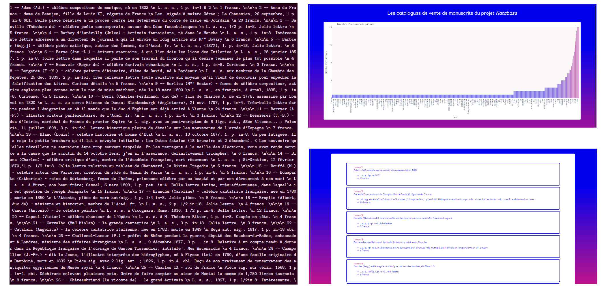

# `text2web` : introduction à l'analyse textuelle, création d'une édition web depuis un texte brut et introduction à la visualisation en python

---

## Présentation



Ce tutoriel d'introduction à Python présente les bases de l'analyse automatisée de grands corpus textuels à
l'aide de Python et offre une première introduction à la visualisation de données. À partir d'un fichier en
texte brut, nous produisons un HTML structuré avec des visualisations. En bref, passer de l'image de gauche
à celle de droite, ce qui est pas mal pour un début !
- **langages utilisés** : python, html
- **processus** : 
    - structurer le texte en identifiant ses différentes parties de façon "automatique"
    - créer une édition web
    - compter les occurrences de chaque mot du texte
    - produire une visualisation interactive à partir de ce décompte.
- **compétences mises en œuvre**:
    - structuration du texte brut à l'aide de listes et de dictionnaires
    - l'utilisation de fonctions, de listes et de dictionnaires
    - la lecture et l'écriture de fichiers
    - l'écriture et la manipulation de JSON
    - la création de HTML "en masse"
    - bases de l'analyse textuelle (data mining) : le décompte des occurrences de chaque mot
    - la création de visualisations avec [Plotly](https://plotly.com/python/)
    - (bonus) une introduction à la rechrche de motifs à l'aide d'expressions régulières
    - (bonus) une introduction à la manipulation de XML avec la librairie [lxml](https://lxml.de/).
- **niveau** : débutant/intermédiaire. Tout est expliqué et détaillé, donc en théorie compréhensible par
  un.e grand.e débutant.e. Il est quand même préférable d'avoir des bases en python (utilisation de fonctions,
  différents types de données et manières de les manipuler).
- **langue**: français (mais vous l'aurez remarqué)

Le **tutoriel** est structuré sous la forme de 4 notebooks jupyter, qui permettent d'avoir du texte explicatif
et des scripts python directement exécutables. Le tutoriel contient aussi des exercices corrigés pour se faire
la main à l'utilisation de Python. Le tutoriel est également accessible sous la forme de 
scripts python largement commentés, disponibles dans le dossier `src/`.

En **bonus**, un script python largement commenté détaille la création du fichier utilisé comme source du
tutoriel. C'est le script `utils/to_text.py`. Il donne une introduction à l'utilisation de `lxml` et des
expressions régulières.

Les données utilisées en source sont produites par le projet [Katabase / MSS](https://katabase.huma-num.fr/) 
(UniGe, UniNe, ENS).

---

## Structure du dépôt

- `img/` : dossier contenant les images
- `input/` : dossier contenant le texte utilisé comme source pour le tutoriel
- `output/` : dossier pour stocker les fichiers produits (pas sur github)
- `src/` : scripts python à la base des notebooks
    - `text2web_html.py` : création automatique de HTML à partir d'un texte brut
    - `text2web_viz.py` : analyse statistique du fichier et visualisation de données
- `utils/` : fichiers utilisés pendant le tutoriel
    - `static/` : dossier contenant une feuille de style CSS et les fontes utilisées par notre site web (toutes deux open source)
    - `to_text.py` : script python utilisé pour la création du fichier source (dans input/)
    - `catalog_web_skeleton.html` : squelette de HTML auquel on viendra ajouter le contenu créé pendant les tutoriels
- `0_text2web_intro.ipynb` : 1er notebook introductif
- `1_text2web_html.ipynb` : 2e notebook: traitement du document source et création automatique d'un fichier HTML
- `2_text2web_viz.ipynb` : 3e notebook: analyse statistique basique du document source et création de visualisations
- `install.sh` : script d'installation du notebook
- `requirements.txt` : librairies à installer

---

## Installation et utilisation

Ce manuel d'installation/utilisation fonctionne pour Linux (ubuntu et distributions dérivées de debian) et MacOS

--- 

### Installation automatique

Un script shell a été créé pour installer tout ce dont on a besoin en 3 étapes toutes simples.
Ouvrir un terminal, se déplacer où on veut que le dépôt soit cloner et entrer les commandes:

```shell
# le script a été testé et fonctionne sur linux + bash, version 5.0.17(1)-release (x86_64-pc-linux-gnu)
git clone https://github.com/paulhectork/tutorial_text2web.git  # cloner le dépôt 
cd tutorial_text2web  # se déplacer dans le dossier contenant le clone
bash install.sh  # lancer le script
```

### Installation manuelle

Si pour une raison ou une autre l'installation automatique ne fonctionne pas, vous pouvez la faire à la main.
Ouvrir un terminal, se déplacer là où l'on veut stocker le dépôt et entrer:

```shell
git clone https://github.com/paulhectork/tutorial_text2web.git  # cloner le dépôt
cd tutorial_text2web  # se déplacer dans le dossier contenant le clone
python -m venv env_tutoriel  # créer un environnement virtuel
source env_tutoriel/bin/activate  # activer l'environnement python
pip install -r requirements.txt  # installer les librairies
# vérifier qu'on a tous les fichiers dont on a besoin, surtout dans `input/`, `utils/` et qu'on a les 4 notebooks
```

---

### Utilisation

Encore une fois, l'utilisation fonctionne pour Linux et MacOS. Il faut être dans le dossier contenant le dépôt.

#### Utiliser des notebooks

Les notebooks permettent d'avoir à la fois du texte explicatif et des scripts pythons exécutables.
Le tutoriel est divisé en 4 notebooks (1 d'introduction, 2 comprenant le tutoriel, un pour les corrections)
```shell
source env_tutoriel/bin/activate  # sourcer le bon environnement python
jupyter notebook  # lancer les notebooks
```

#### Utilisation des scripts python

Si l'on préfère lire le code python directement, en étant à la racine du présent dossier. 

- pour le code du tutoriel à propremement parler, on peut exécuter et lire les scripts (très commentés) ainsi:
```shell
cd src/
python text2web_html.py  # lancer le 1er script, qui correspond au notebook 1
python text2web_viz.py  # lancer le 2e script, qui correspond au notebook 2
```

- pour faire fonctionner le script utilisé dans la création du fichier source (`input/source.txt`),
```shell
cd utils
git clone https://github.com/katabase/1_OutputData.git  # cloner le dossier contenant les xml source
python to_text.py  # lancer le script de création. ne pas hésiter à y jeter un oeil, il est très commenté
```
